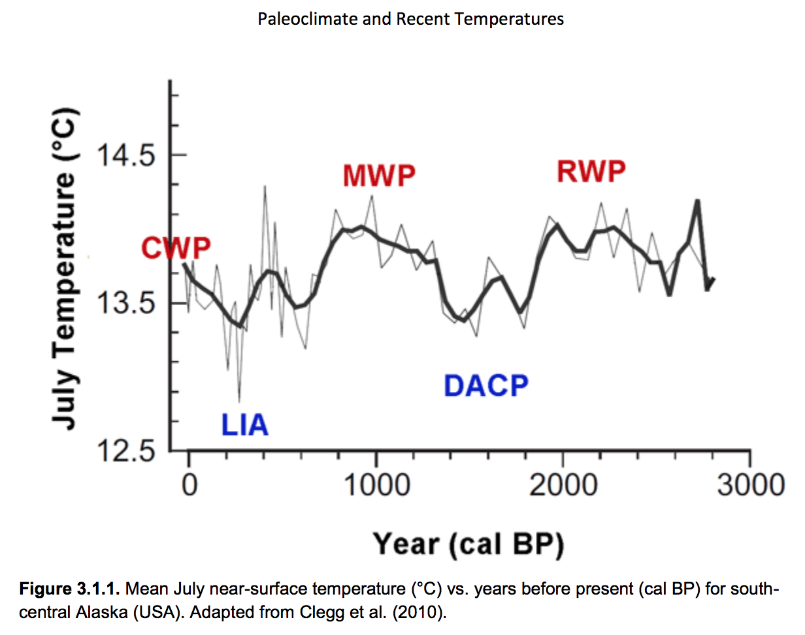
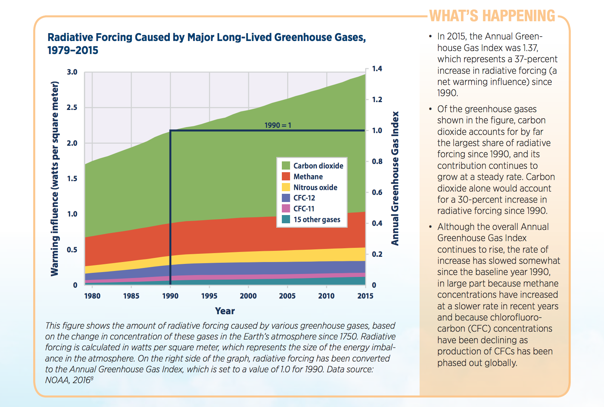
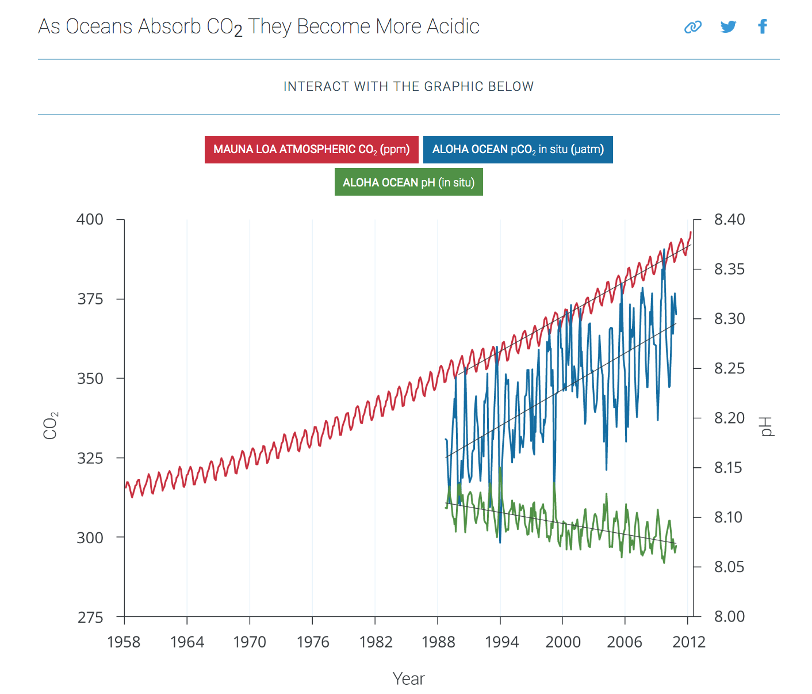
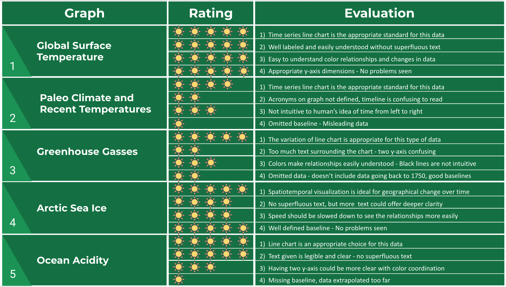

# Analysis Overview

Data visualizations are an important part of how one communicates data to an audience, especially in this age of data abundance. Critically analyzing visualizations in order to understand the narrative and to identify misrepresentations is important due to how much information people gather from visualizations both online and in the workplace. Visualizing data can either be incredibly informative, displaying otherwise hidden information within datasets, or it can deceive viewers if the visualization falls into certain common pit-falls. 

Here I will discuss climate change and create a system of criteria through which I will analyze 5 graphs intended to argue for or against human's having a role in Earth's changing climate. 

# Background on Climate Change and Global Warming

According the EPA climate change is defined as significant changes in climate measurements lasting for an extended period of time of decades or longer. While global warming is one measured effect of climate change, it is only the measurement of the average increase in atmospheric temperature near the Earth's surface, whereas measurements of precipitation and temperatures are other examples of climate change. Many other periods in earth’s history have also experienced changes in climate, however most scientists are confident that current changes are linked to the increase in carbon dioxide and greenhouse gas levels in our atmosphere, which have been primarily increasing because of human activity (^1).

Since communicating causality of climate change is challenging, indicators are used to show measurements and trends of changing environmental conditions representing either the causes or effects of climate change. Some of these indicators can then in turn be more directly linked to human activity. The EPA uses 37 indicators in their climate change report using multiple peer reviewed data sources with six categories of indicators, including: Greenhouse Gases, Weather and Climate, Oceans, Snow and Ice, Health and Society, and Ecosystems [@EPA]. While I will be analyzing graphs from multiple sources, each of the visualizations will be within these six indicator categories. 

# Data Visualization Guidelines

Charts, plots and graphs are extremely powerful tools when communicating about data on climate change. Many different types of viewers consume climate change visualizations to inform opinions about the subject as well as make decisions based on these opinions. Grainger, Mao and Buytaert express a need for scientist to have a better framework when designing visualizations based on their research to better disseminate information for not only a scientific audience, but also a lay audience. Without this framework some audiences can experience uncertainty and therefore can create misunderstandings and ultimately biased messages and ill informed decisions [@Environmental_Data_Visualization].

## 1) Visualization Type

There are many different ways to visualize data and deciding which type best communicates the data is of great importance. Generally, the following types of graphs best correspond to certain types of data:

**Graph Style**  | **Data Types**
------------- | -------------
Line Charts  | Temporal Data for one or more groups of data
Bar Charts  | Quantitative data from several categories
Scatter Plots | Values for relating two variables 
Pie Charts | Only used to display parts of a whole

[@Best_Practices]

Grainger et al. describe the evolution of geovisualization as the multidisciplinary field that is creating more intuitive ways to communicate environmental research using spatial and temporal dimensions [@Environmental_Data_Visualization]. Using temporal data (time series graph to represent chronological change) is very common and helps to clearly communicate how environmental factors change over time. Spatial data on the other hand has traditionally been a way to display static physical characteristics on a map [@Environmental_Data_Visualization]. Representing both dimensions is still challenging but has become more popular as the field advances. While it's not a necessary criteria for evaluating the graphs below, spatiotemporal graphic is considered the preferred method of communicating changes to geography over time [@Environmental_Data_Visualization]. 

## 2) Textual Criterion

A fundamental principle of visualizations, according to visual perception theory, is for data presentations to lead the audience through the most prominent features of what is being conveyed without the assistance of text-based explanations [@Environmental_Data_Visualization]. 

While charts and graphs shouldn't need a lot of text in order to explain the visualization, the text that is labeling the graph should be legible. Font choice and font size can both affect readability, so the text should be in a non-stylistic font and should be large enough to easily read the legends of the graph [@Best_Practices].

## 3) Visual Perception Standards

Another principal through which we will evaluate our climate change data representations is C.R.A.P. (Contrast, Repetition, Alignment, and Proximity), which is inspired by Gestalt theory of human's ability to perceive patterns in the stimulus based on 5 categorical rules (Proximity, Similarity, Continuity, Enclosure, and Connection) [@Environmental_Data_Visualization]. Through this we will look for graphical features such as color and hue, size, orientation, and shape that increase the viewers ability to easily infer key points of the graph and enhance pattern detection. 

## 4) Data Visualization - What to Avoid

The principals listed above are useful guidelines for how to properly make effective visualizations, however, there are also many ways in which a visualization could be misleading or manipulative to the audience. For the sake of our visualization framework we will use the word clarity in reference to this category of evaluation. 

One of the most common ways for graphs to become misleading is when the authors omit the baseline number for the graph. For example, if the graph represents data in percentages, but the bottom of the bar chart begins at 50, then the graph has omitted the baseline of zero and can over-amplify the differences between categories. Similarly, changing the y-axis scale by adding additional space above the end of the data points can visually dampen the volatility in the graph [@Misleading_Graphs][@Best_Practices]. 

Visualizations can also pick and choose data that suits the needs of the story the author is trying to tell. While changing the scale and y-axis of a visualization is misleading, this seems like a more manipulative tactic and readers should scrutinized carefully. Only including certain data points (most common in a time series graph) is one way to skew the story. For example if the total dataset of a stock price includes a timeline between from when the stock had its initial public offering and the current day, but the graph shows only three months of data, it can seem that the company is doing very well recently, though, the decline in price over many years would only be shown by the whole timeline. Visualizations can also be misleading if the data was consolidating in a way that makes a story look different than how the data was collected. For instance, if a political poll is taken and has four questions (a scale of approval rating), and the graph only reports two extremes of the scale for only one of the political parties, then the graph is omitting the whole story of how the data was collected and the overall outcome of the poll  [@Misleading_Graphs].  

Other misinformation through visualizations can be due to improper visualizations that skew people’s perception of the information being communicated. Graphs that do not use the C.R.A.P. principal might mislead viewers with 3-D graphs that make it harder to see what the comparison between categories is or have graphics of different sizes for which the sizes don't accurately represent the comparison of the numerical values [@Misleading_Graphs][@Best_Practices]. 

# Climate Change Graphs

The five visualizations below are all of different arguments about climate change. Below each is an explanation of how they fit into the discussion about climate change and how they adhere to the framework. After all of the visuals have been defined an explained, there is a chart to rate each category for the evaluation of each visualization.

Each of the visualizations are evaluated based on these four categories:

1. The type of chart, graph or plot used and how it suits the data
2. The use of text in the visualization: how much text, proper labeling, and text clarity
3. The visual perception of the chart or graph: color usage, relation between data-types, visual aesthetic
4. The clarity and persuasiveness of the visualization: not misleading in scaling, completeness of data used

## Graph 1
### Global Surface Temperature Analysis from Four Independent Data Sources

This graph is a very compelling visualization all of the ways defined by the framework. It not only adheres to visualization best practices; it is also a well-defined indication of global warming. Scientific experiments require replication and peer review in order to become a scientific theory. The independent data sets that all indicate global warming is very convincing. 

#### Evaluation

1. The line chart is very well suited to represent this type of data due to an easy to read left to right timeline on the x-axis
2. A large amount of text is not needed to explain this chart- it is intuitive as is and there is no superfluous text.
3. The color variation is distinct and contrasting, making it easy to see differences and similarities between datasets. 
4. The data definition is well represented, and the y-axis scale is perfect according to our framework. This is a very persuasive visualization.

## Graph 2
### Paleoclimate and Recent Temperatures

This figure is from a paper called Climate Change Reconsidered: 2011 Interim Report by the Nongovernmental International Panel on Climate Change (NIPCC). This visualization argues that there are multiple oscillations in temperatures over long periods of time and therefore the global warming experienced now is simply due to natural temperature change cadence. This data (mean July temperatures) was reconstructed from midge assemblages found in sediments of Moose Lake in Alaska. Details are not given for how the data was reconstructed for the prior 6,000 years, or how they assumed the data to be from July of each year. 

#### Evaluation

1. The line chart is generally well suited for time series data; however, it is much more intuitive to see time chronologically from left to right as opposed to right to left when using before present. 
2. While the chart is not cluttered with superfluous text, it also does not have enough text to know what each of the acronyms mean. Each acronym was defined throughout the journal article, however, for people who don't generally remember 5 acronym definitions many pages later, this graph can be frustrating because of needing to look back through the paper. 
3. I am unsure what the two different lines represent, and they are not defined. The only color in the chart is of the acronyms for which there is no definition, so the eye goes to the part that is most confusing on the chart. 
4. The baseline is omitted on the y-axis, which skews the scale of the visualization. Data collection is unclear. 

## Graph 3
### Greenhouse Gasses 

Greenhouse gasses including carbon dioxide (CO2) emissions is what most scientists attribute to the rapid rise in global warming as well as the other geological and weather anomalies that are also changing quickly. In terms of the argument made that atmospheric CO2 is increasing over time, the visual is compelling, however, there are many items within our framework that need to be addressed with this graph. 

#### Evaluation

1. The graph choice is a variation of the standard line graph representing temporal data well. 
2. There is a large quantity of text to explain the features about this graph, which means the graph is not intuitive enough to understand it by looking at it. 
3. The color relationship visuals are easy to understand, and the increase is an appealing visual. 
4. The baseline for each of the y-axis are appropriate for the graph, however the text below the graph states that the data for concentration of gasses in the atmosphere dates back to 1750 and this only represents about 13% of the total data. The warming influence measurement and the annual greenhouse gas index are not well defined as measurements and are perhaps not necessary to put on the same visualization. 

## Graph 4
### Arctic Sea Ice 

As stated above when creating the framework defining good visuals to indicate changes in geology over time, 
spatiotemporal graphics are newer forms of visualizations that have come with better technology, and this graphic is a good example. When showing the amount of ice over time, it is most intuitive to see these changes on a map. 

#### Evaluation

1. This is the best example out of the five visualizations of how graph choice makes the data intuitive across all audiences. 
2. There is not any unnecessary text in this visualization, however it would have been nice if the average (baseline) that was defined at the beginning was present throughout the whole visual so that it was easier to read. 
3. The colors and relationships are very easily identified in this visualization, however slowing the timing down would help with comprehension. 
4. The baseline is visually defined, and the data is from a reputable source.

## Graph 5
### Ocean Acidity

This graph is a very good example of the relationship between human involvement (Atmospheric CO2) and the downstream effect of climate change (ocean pH). 

#### Evaluation
1. The line chart is a good choice to visualize this data.
2. The amount of text for the chart is appropriate. Each axis is labeled clearly, and the chart is easily comprehended.
3. The color coordination for each of the lines is good, however having two y-axis is confusing because each line is read on a different scale. Having the left y-axis label underlined in blue and red, and the right axis underlined in green would make it intuitive to understand the two lines associated with that scale.
4. It is unclear on either axis what the baseline is for each of the graphs, meaning the viewer doesn't know what the amount of CO2 in the atmosphere should be at for normal levels. Also, the title of the graph is a large extrapolation from the data that is plotted. This data is only from one ocean and the title is generalizing this finding to all oceans. 

## Graph Rating

